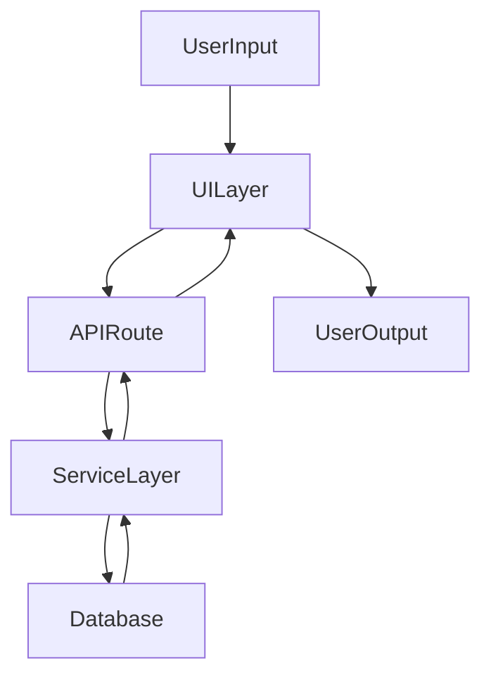

## Data flow

Describe how data moves through SpecEngine from user input to storage and back.

### High-level flow

- User interactions in the UI.
- API calls and validation.
- Business logic and transformations.
- Persistence to and from the database.

### Example request flow (to be refined)

Update this document when you introduce new major flows (e.g., background jobs, event-driven pipelines).

