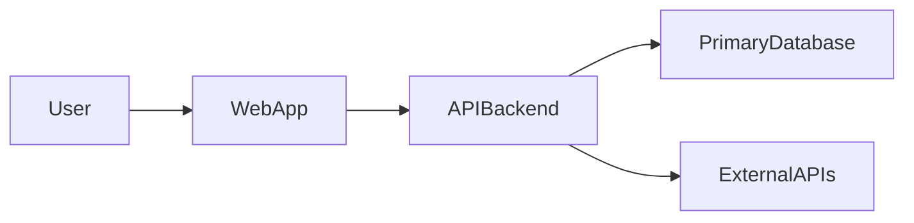

## System architecture

### Context

Describe where SpecEngine fits in the wider ecosystem (users, external systems, third-party services).

### High-level components

- Client applications (web, mobile).
- Backend services / API.
- Database and storage.
- External integrations (e.g., auth providers, analytics, payment, third-party APIs).

### Example component diagram (to be refined)

Update this document as the system evolves, keeping diagrams and descriptions in sync with reality.

